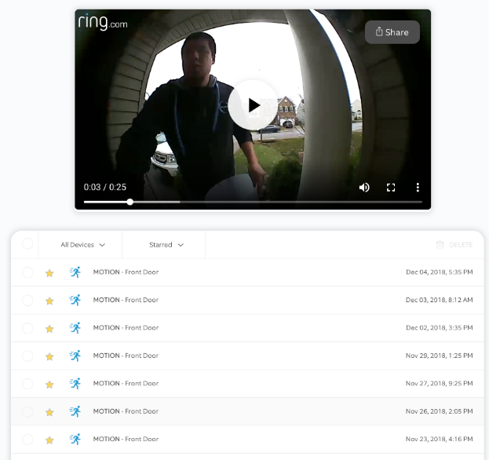

# Face Detection using Ring Doorbell Videos

## Choice of dataset: 
Dataset is a set of surveillance videos from my ring doorbell that have been downloaded in MP4 format. The videos will be converted to image sequences for processing.

## Goal: 
The goal of the project is to detect faces in the video using pre-trained classifiers from openCV and then to segment and isolate those faces within the bounding box of the detected face. 

 
## Proposed techniques: 
Use of pre-trained classifiers from openCV for frontal, angled, and side view faces will be used to detect faces within the the image as well as their bounding boxes. An example of using a pre-trained openCV classifier within scikit-image can be found at: http://scikit-image.org/docs/dev/auto_examples/xx_applications/plot_face_detection.html 
Once the bounding boxes have been identified, segmentation techniques will then be used to isolate the faces within the image and to save them to a folder of detected faces. A thresholded image will be used to isolate the detected face and covert remaining background to black.

## Resources/libraries: 

Two common classifiers are used for face detection in openCV
LBP cascade classifier
Haar feature-based classifier (uses edges/lines as features)

https://docs.opencv.org/2.4/modules/objdetect/doc/cascade_classification.html 
https://docs.opencv.org/3.4/d7/d8b/tutorial_py_face_detection.html 

openCV contains a number of pre-trained models for frontal face recognition. Additional pre-trained models for side or profile faces may be downloaded and used as well. 

openCV may also be used  to convert video to image sequences and back to video:
https://docs.opencv.org/2.4/modules/highgui/doc/reading_and_writing_images_and_video.html 

# Output

* [Resulting Video](https://www.youtube.com/embed/vsYzCad0C6A?rel=0)
